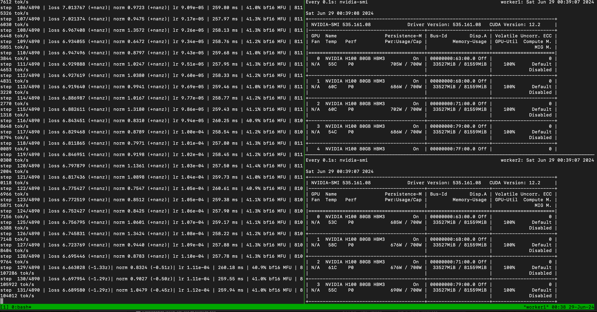

# Run llm.c on Lambda 1-Click Clusters

Welcome to the Lambda Labs 1-Click Clusters setup guide for training [Andrej Kapathy](https://twitter.com/karpathy)'s [llm.c](https://github.com/karpathy/llm.c)! 🚀 Building on Andrej's [reproduction guide](https://github.com/karpathy/llm.c/discussions/481), we have made small adjustments to simplify the setup for 1-Click Cluster's [existing hardware](https://lambdalabs.com/blog/introducing-lambda-1-click-clusters-a-new-way-to-train-large-ai-models) (including InfiniBand NICs and shared storage) and [software stack](https://lambdalabs.com/lambda-stack-deep-learning-software).


### Step 1: Distribute key & hostfile

Run the following commands from your local machine
```
# Specify your 1cc cluster key and 1cc storage accordingly
export CONFIG_PATH=<path-to-your-1cc-key>
export STORAGE_PATH=<path-to-your-1cc-storage>

# distribute ssh key across the cluster
bash ssh_init.sh

# Set up llm.c
bash setup_llm.c.sh
```

### Step 2: Run distributed llm.c training from the head node

`ssh` into the head node and run the following command:

```
# Don't forget to set up STORAGE_PATH on your head node
export STORAGE_PATH=<path-to-your-1cc-storage>

export LLMC_PATH=$STORAGE_PATH"/llm.c"
export binary_path=$LLMC_PATH"/train_gpt2cu"
export out_dir=$LLMC_PATH"/log_gpt2_124M_multi"
export train_data_path=$LLMC_PATH"/dev/data/fineweb10B/fineweb_train_*.bin"
export val_data_path=$LLMC_PATH"/dev/data/fineweb10B/fineweb_val_*.bin"

export hostfile_path=/home/ubuntu/hostfile_1cc_worker_mpirun
export OMPI_MCA_btl_tcp_if_include=enp8s0
export UCX_TLS=self,shm,tcp
export NCCL_P2P_LEVEL=NVL
export NCCL_NET_GDR_LEVEL=PIX
export NCCL_IB_HCA='=mlx5_1,mlx5_2,mlx5_3,mlx5_4,mlx5_5,mlx5_6,mlx5_7,mlx5_8'
export NCCL_IB_PCI_RELAXED_ORDERING=1
export NCCL_SOCKET_IFNAME=enp8s0
export NCCL_DEBUG=INFO

mpirun --hostfile $hostfile_path \
    $binary_path \
    -i "$train_data_path" \
    -j "$val_data_path" \
    -o $out_dir \
    -v 250 -s 20000 -g 144 \
    -h 1 \
    -b 64 -t 1024 \
    -d 2097152 \
    -r 0 \
    -z 1 \
    -c 0.1 \
    -l 0.0006 \
    -q 0.1 \
    -u 700 \
    -n 1000 \
    -y 0 \
    -e d12 \
    -pi "mpi"
```

Example output on a 16xGPU 1-Click Cluster

